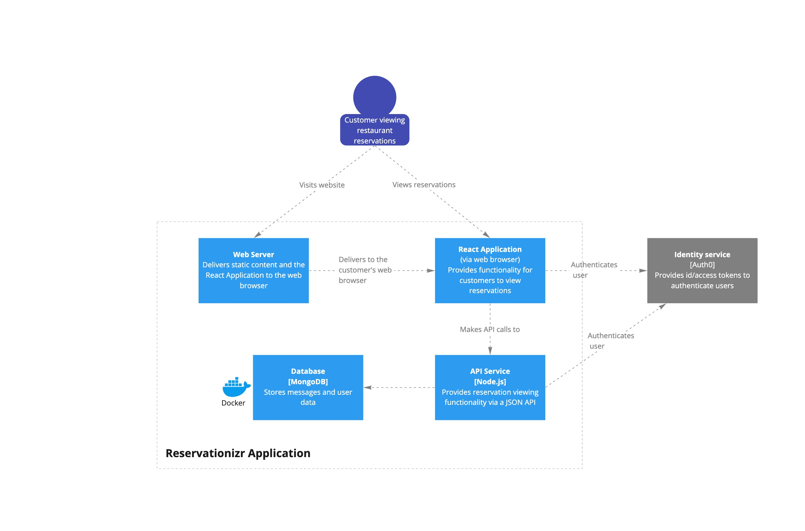
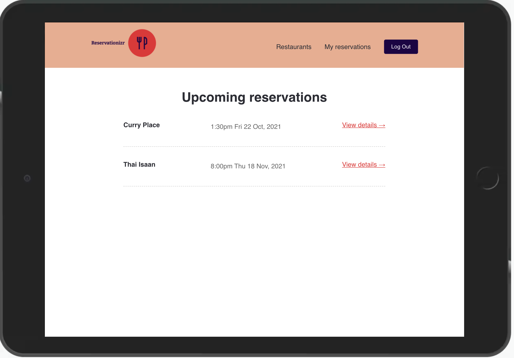
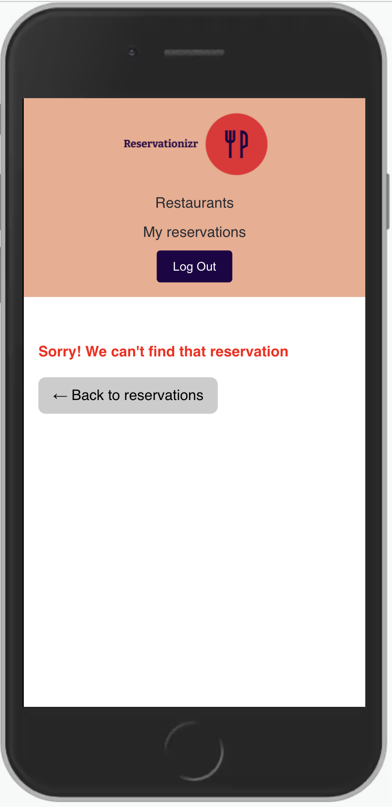

# Application

This application was part of a project that I have completed at Developers Institute NZ. A small restaurant booking application done in React JS frontend and Node JS for backend API using MongoDB as the database.

The `client` folder contains the React Application, and the `server` folder contains the Express application.

## Client

- In a new Terminal window, type: `cd client` to change directory into the client folder
- Type `npm install` to install npm dependencies
- Type `npm start` to start the React Application

## Server

- In a new Terminal window, type: `cd server` to change directory into the server folder
- Type `npm install` to install npm dependencies
- Type `npm start` to start the Express Server

## MongoDB Database

- In a new Terminal, type `docker-compose up` to start the MongoDB server in a Docker container
- Connect to MongoDB using [MongoDB Compass](https://www.mongodb.com/products/compass). Create a database named `mongo`, a collection named `restaurants`, and load data from the [data](./data) folder into the database.

# Architecture diagrams

---

# API specification

To view the documentation for the API specification:

1. Open a Terminal in VS Code for this project
2. Type `cd server` to change directory into the server folder
3. Type `npm run docs` to start a web server with API documentation
4. Open the link displayed in your browser (it's automatically copied to your clipboard)

   

## Load the API Specification in Insomnia

You can automatically load all the available endpoints in Insomnia.

1. Go to the Insomnia Dashboard
2. Click the purple `Create` button
3. Select `File`.
4. Navigate into this exercise folder, and choose `server/e2e/api-spec.yml`.
5. Import as a `Request Collection`.
6. You can then open the Reservationizr API 1.0 Collection. Insomnia will load the endpoints for you.

---

## User Story #1 - View all restaurants

- **As a** restaurant connoisseur
- **I want** to view a list of restaurants
- **So that** I can choose the one I want to make a reservation for

**Acceptance criteria**

- When visiting http://localhost:3000 in the React application, a list of restaurants are displayed.
- The page matches the design.
- The route meets the API specification, and the automated API Specification test passes for this route
- The code for the API is well tested with automated tests

### Design brief

---

## User Story #2 - View a single restaurant

- **As a** restaurant connoisseur
- **I want** to view restaurant details for a single restaurant
- **So that** I can determine if I want to reserve a table

**Acceptance criteria**

- Given the customer is viewing the list of restaurants in the React application, when the `Reserve now` button is clicked for a restaurant, then the customer is redirected to the `/restaurants/:id` route
- Given the customer is visiting the `/restaurants/:id` route in the React application, then the restaurant is displayed to the customer.
  - **Example url:** http://localhost:3000/restaurants/616005cae3c8e880c13dc0b9
- The page matches the design.
- The route meets the API specification, and the automated API Specification test passes for this route.
- The code for the API is well tested with automated tests. Tests include happy and negative test cases.

### Design brief

---

## User Story #3 - Book a reservation

- **As a** restaurant connoisseur
- **I want** to book a reservation at a restaurant
- **So that** I can enjoy a meal at the restaurant

**Acceptance criteria**

- Given the customer is unauthenticated in the React application, when visiting the `/restaurants/:id` route, then the customer is redirected to the Auth0 Login page
  - **Note** You will need to make the `/restaurants/:id` route in `client/src/App.js` a protected route
- Given the customer is authenticated in the React application, when visiting the `/restaurants/:id` route, then a form is displayed to make a new reservation for the restaurant.
- Given the reservation form has been completed, when the form is submitted, then a new reservation is created by calling the API, and the customer is redirected to the `/reservations` route
  - **Note:** when authenticated, the user's id is stored on `req.auth.payload.sub` in the Express route handler.
- The route meets the API specification, and the automated API Specification test passes for this route.
  - **Note** To make the API specification tests for this route pass in GitHub, see the note below on adding Auth0 credentials to the GitHub repository.
- The code for the API is well tested with automated tests. Tests include happy and negative test cases.
- The 'Make a reservation' form matches the design.
  - **Note** Use [react-datepicker](https://github.com/Hacker0x01/react-datepicker) for the Date input

### Design brief

## User Story #4 - View all my reservations

- **As a** restaurant connoisseur
- **I want** to view the reservations I have made
- **So that** I can be reminded of when my next reservation is

**Acceptance criteria**

- Given the customer is unauthenticated in the React application, when visiting the `/reservations` route, then the customer is redirected to the Auth0 Login page.
- Given the customer is authenticated in the React application, when visiting the `/reservations` route, then all the reservations the authenticated customer has made are displayed on the page.
  - **Note** If another user authenticates, they **should not** be able to see other customers reservations.
- Given the customer is authenticated in the React application, when visiting the `/reservations` route, when the customer has not made any reservations, then the customer is shown a message indicating they have no reservations.
- The page matches the design.
- The route meets the API specification, and the automated API Specification test passes for this route.
- The code for the API is well tested with automated tests.

### Design brief

---

## User Story #5 - View a single reservation

- **As a** restaurant connoisseur
- **I want** to view the details for a single restaurant reservation I have made
- **So that** I can attend the reservation

**Acceptance criteria**

- Given the customer is visiting the `/reservations/:id` route in the React application, when the customer is unauthenticated, then the customer is redirected to the Auth0 Login page.
- Given the customer is visiting the `/reservations/:id` route in the React application, when the reservation is created by the customer, then the reservation is displayed to the customer.
- Given the customer is visiting the `/reservations/:id` route in the React application, when the reservation is **not** created by the customer, then a "not found" error is displayed to the customer
- The page matches the design.
- The route meets the API specification, and the automated API Specification test passes for this route.
- The code for the API is well tested with automated tests. Tests include happy and negative test cases.

### Design brief

---
